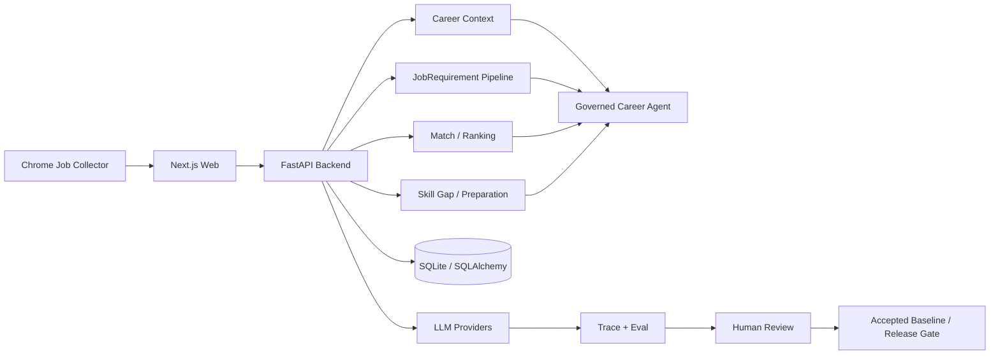

# JobLens Agent

> Evidence-grounded AI career agent built on real job-market data.
>
> 基于真实招聘岗位与个人经历证据的 AI 求职 Agent：不是“让模型替你猜匹配度”，而是把 **Profile Evidence → Job Requirements → Match → Ranking → Feedback → Skill Gap → Preparation** 做成一条可评测、可追溯、可回归的工程闭环。

[](https://github.com/peewee92/JobLens-Agent/actions/workflows/ci.yml)
[](LICENSE)

## Why JobLens

Most AI job-search demos do one thing:

```text
Resume + Job Description → Prompt → Match Score
```

JobLens treats career recommendations as an evidence and quality problem instead:

```text
Real Profile Evidence
        +
Real Job Postings
        ↓
Versioned JobRequirement Fact Base
        ↓
Eligibility + Evidence-grounded Match
        ↓
Ranking + User Feedback
        ↓
Target Cohort + Skill Gap
        ↓
Resume / Interview Preparation
        ↓
Eval → Human Review → Regression → Release Gate
```

The product goal is deliberately narrow:

> **Given my real experience and a batch of real target jobs, which jobs should I apply to first, and what evidence supports that recommendation?**

## What is implemented

### 1. Real job collection

`apps/collector-extension` is a Chrome extension used to collect real job postings and preserve source quality instead of feeding manually copied JD fragments into the model.

It supports:

- BOSS job search collection;
- multi-city / remote filtering;
- salary filtering and obfuscated-font decoding;
- job deduplication;
- detail-page enrichment and multiline JD preservation;
- source-quality levels such as `full_jd / partial_jd / card_only / unavailable`;
- export of raw jobs, diagnostics and Requirement-review datasets.

### 2. Versioned career evidence

JobLens does not let an LLM silently rewrite the user's career history.

Profile, Evidence and SearchIntent are explicit, versioned facts. Resume extraction first produces a proposal, then a human-confirmed profile becomes the released source of truth.

### 3. JobRequirement fact base

Raw job descriptions are converted into structured, versioned `JobRequirement` facts. Downstream Match / Gap / Preparation flows consume this fact base rather than independently rereading the raw JD and producing inconsistent interpretations.

### 4. Evidence-grounded matching

Recommendations are grounded in:

- confirmed profile evidence;
- explicit search intent;
- released job requirements;
- current match facts and user feedback.

A numeric score is treated as an internal ranking signal, **not a probability of getting the job**.

### 5. Eval-first quality loop

The project applies evaluation from the first LLM pipeline rather than adding an eval dashboard after the product is finished.

```text
Dataset
  ↓
Run
  ↓
Trace / Structured Output
  ↓
Deterministic Assertions + Human Review
  ↓
Accepted Baseline
  ↓
Bad Case Remediation
  ↓
Regression
  ↓
Release Gate
```

Real rejected cases are converted into regression tests before a new semantic policy is released.

### 6. Governed Career Agent layer

The current Career Agent is intentionally **workflow-first** instead of pretending every business action should be an autonomous agent tool.

It already provides:

- a governed Context Builder;
- an explicit Tool Registry;
- coarse-grained read-only tools for Ranking, Skill Gap and Job Preparation;
- fail-closed context validation;
- deterministic Agent routing / grounding evals.

The next runtime step is natural-language tool routing and a bounded multi-turn Agent Loop on top of these mature workflows. The project deliberately does **not** claim this part is complete yet.

## Architecture



### Backend structure

The backend is a **Modular Monolith**, not a demo split into unnecessary microservices:

```text
services/backend/app/
├── api/
├── domain/
├── application/
├── repositories/
├── llm/
├── workflows/
├── agent/
├── evals/
└── tracing/
```

The repository is a polyglot monorepo:

```text
JobLens-Agent/
├── apps/
│   ├── web/                  # Next.js user-facing application
│   └── collector-extension/  # real-job collection Chrome extension
├── services/
│   └── backend/              # FastAPI modular monolith
├── packages/
│   └── contracts/            # cross-boundary contracts
├── data/
│   ├── samples/              # safe sample / fixture data
│   └── evals/                # evaluation datasets
└── docs/                     # architecture, ADRs and implementation notes
```

## Engineering evidence

Current local verification on the main development environment:

- **1027 Backend tests passing** (`pytest`);
- **153 Web tests passing**;
- **1180 automated tests passing in total**;
- Web TypeScript typecheck passes;
- schema migrations are managed by Alembic;
- LLM release paths use explicit eval / review / gate boundaries;
- local runtime data, resumes, databases and secrets are excluded from Git.

These numbers are a snapshot, not a substitute for the CI status above.

## Core design decisions

| Problem | Decision |
|---|---|
| LLM invents career evidence | Important recommendations must link back to confirmed Evidence or JobRequirement facts |
| Every feature becomes an Agent tool | Stable business capabilities stay as Workflows; the Agent composes them |
| Match score is misunderstood | Score is ranking-only, never presented as hiring probability |
| Prompt/model change silently changes production behavior | Versioned eval run + baseline comparison + release gate |
| Bad cases are fixed only by prompt tweaking | Convert real rejected cases into deterministic regression where possible |
| Human decisions get overwritten | Reviews / final decisions are explicit and immutable at the governance boundary |
| Agent receives too much raw context | Governed Context Builder exposes the minimum released facts required by the turn |

More detail:

- [System Architecture](docs/architecture/SYSTEM-ARCHITECTURE.md)
- [Domain Model](docs/architecture/DOMAIN-MODEL.md)
- [Eval & Trace](docs/architecture/EVAL-AND-TRACE.md)
- [LLM / Workflow / Agent Boundary](docs/decisions/0004-llm-workflow-agent-boundary.md)
- [Eval from Day One](docs/decisions/0005-eval-from-day-one.md)
- [Repository Strategy](docs/decisions/0006-repository-strategy.md)
- [Career Agent evolution plan](docs/implementation/P1-Career-Agent-Workflow-First-to-Governed-Agent-Evolution-Plan.md)

## Quick start

### Backend

Requirements: Python 3.12+ and [`uv`](https://docs.astral.sh/uv/).

```bash
cd services/backend
cp .env.example .env
uv sync
uv run alembic upgrade head
uv run uvicorn app.main:app --reload --port 8000
```

Run tests:

```bash
cd services/backend
uv run pytest -q
```

### Web

Requirements: Node.js and `pnpm`.

```bash
cd apps/web
cp .env.example .env.local
pnpm install
pnpm dev
```

Run verification:

```bash
cd apps/web
pnpm test
pnpm typecheck
pnpm build
```

> The repository intentionally ships only safe samples and fixtures. Personal resumes, local databases, raw private job datasets and Provider credentials should remain local.

## Product workflow

```text
1. Import / confirm career profile
2. Define SearchIntent
3. Collect or import real target jobs
4. Extract JobRequirements
5. Pass requirement quality gate
6. Run eligibility + evidence-grounded Match
7. Rank the batch
8. Record explicit user feedback
9. Build a target cohort and analyze Skill Gaps
10. Prepare evidence-grounded resume / interview material
```

## Current Agent boundary

JobLens intentionally distinguishes **AI workflows** from an **Agent Runtime**.

Implemented today:

```text
Governed Context
      ↓
Structured Career Agent turn
      ↓
Tool Registry
      ↓
Mature Workflows
      ↓
Grounded output
```

Runtime evolution target:

```text
Free-form user request
      ↓
LLM decision
      ↓
Tool call → validation → execution
      ↑                    ↓
      └──── tool result ───┘
      ↓
Bounded completion + grounded final answer
```

Planned runtime work focuses on tool routing, bounded turns, error classification, context budgeting, trace and Agent Eval — **not Multi-Agent for its own sake**.

## Roadmap

Near-term public-project priorities:

- [ ] natural-language Career Agent tool routing;
- [ ] bounded multi-turn Agent Loop with tool-result replay;
- [ ] context budget / tool-output compaction;
- [ ] Agent Trace and trajectory eval dataset;
- [ ] JobLens MCP / external agent integration;
- [ ] concise demo video and reproducible public sample dataset.

The detailed engineering history remains in `docs/`; the README intentionally focuses on the product, architecture and verifiable engineering evidence rather than internal phase numbering.

## License

MIT. See [LICENSE](LICENSE).
