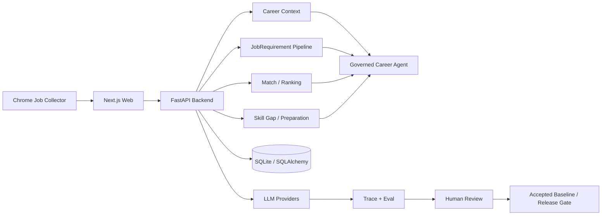

# JobLens Agent

> Evidence-grounded AI career agent built on real job-market data.
>
> 基于真实招聘岗位与个人经历证据的 AI 求职 Agent：不是“让模型替你猜匹配度”，而是把 **Profile Evidence → Job Requirements → Match → Ranking → Feedback → Skill Gap → Preparation** 做成一条可评测、可追溯、可回归的工程闭环。

[](https://github.com/peewee92/JobLens-Agent/actions/workflows/ci.yml)
[](LICENSE)

## Why JobLens

Most AI job-search demos do one thing:

```text
Resume + Job Description → Prompt → Match Score
```

JobLens treats career recommendations as an evidence and quality problem instead:

```text
Real Profile Evidence
        +
Real Job Postings
        ↓
Versioned JobRequirement Fact Base
        ↓
Eligibility + Evidence-grounded Match
        ↓
Ranking + User Feedback
        ↓
Target Cohort + Skill Gap
        ↓
Resume / Interview Preparation
        ↓
Eval → Human Review → Regression → Release Gate
```

The product goal is deliberately narrow:

> **Given my real experience and a batch of real target jobs, which jobs should I apply to first, and what evidence supports that recommendation?**

## What is implemented

### 1. Real job collection

`apps/collector-extension` is a Chrome extension used to collect real job postings and preserve source quality instead of feeding manually copied JD fragments into the model.

It supports:

- BOSS job search collection;
- multi-city / remote filtering;
- salary filtering and obfuscated-font decoding;
- job deduplication;
- detail-page enrichment and multiline JD preservation;
- source-quality levels such as `full_jd / partial_jd / card_only / unavailable`;
- export of raw jobs, diagnostics and Requirement-review datasets.

### 2. Versioned career evidence

JobLens does not let an LLM silently rewrite the user's career history.

Profile, Evidence and SearchIntent are explicit, versioned facts. Resume extraction first produces a proposal, then a human-confirmed profile becomes the released source of truth.

### 3. JobRequirement fact base

Raw job descriptions are converted into structured, versioned `JobRequirement` facts. Downstream Match / Gap / Preparation flows consume this fact base rather than independently rereading the raw JD and producing inconsistent interpretations.

### 4. Evidence-grounded matching

Recommendations are grounded in:

- confirmed profile evidence;
- explicit search intent;
- released job requirements;
- current match facts and user feedback.

A numeric score is treated as an internal ranking signal, **not a probability of getting the job**.

### 5. Eval-first quality loop

The project applies evaluation from the first LLM pipeline rather than adding an eval dashboard after the product is finished.

```text
Dataset
  ↓
Run
  ↓
Trace / Structured Output
  ↓
Deterministic Assertions + Human Review
  ↓
Accepted Baseline
  ↓
Bad Case Remediation
  ↓
Regression
  ↓
Release Gate
```

Real rejected cases are converted into regression tests before a new semantic policy is released.

### 6. Governed Career Agent layer

The current Career Agent is intentionally **workflow-first** instead of pretending every business action should be an autonomous agent tool.

It already provides:

- a governed Context Builder;
- an explicit Tool Registry;
- coarse-grained read-only tools for Ranking, Skill Gap and Job Preparation;
- fail-closed context validation;
- deterministic Agent routing / grounding evals.

The next runtime step is natural-language tool routing and a bounded multi-turn Agent Loop on top of these mature workflows. The project deliberately does **not** claim this part is complete yet.

## Architecture



### Backend structure

The backend is a **Modular Monolith**, not a demo split into unnecessary microservices:

```text
services/backend/app/
├── api/
├── domain/
├── application/
├── repositories/
├── llm/
├── workflows/
├── agent/
├── evals/
└── tracing/
```

The repository is a polyglot monorepo:

```text
JobLens-Agent/
├── apps/
│   ├── web/                  # Next.js user-facing application
│   └── collector-extension/  # real-job collection Chrome extension
├── services/
│   └── backend/              # FastAPI modular monolith
├── packages/
│   └── contracts/            # cross-boundary contracts
├── data/
│   ├── samples/              # safe sample / fixture data
│   └── evals/                # evaluation datasets
└── docs/                     # architecture, ADRs and implementation notes
```

## Engineering evidence

Current local verification on the main development environment:

- **1027 Backend tests passing** (`pytest`);
- **153 Web tests passing**;
- **1180 automated tests passing in total**;
- Web TypeScript typecheck passes;
- schema migrations are managed by Alembic;
- LLM release paths use explicit eval / review / gate boundaries;
- local runtime data, resumes, databases and secrets are excluded from Git.

These numbers are a snapshot, not a substitute for the CI status above.

## Core design decisions

| Problem | Decision |
|---|---|
| LLM invents career evidence | Important recommendations must link back to confirmed Evidence or JobRequirement facts |
| Every feature becomes an Agent tool | Stable business capabilities stay as Workflows; the Agent composes them |
| Match score is misunderstood | Score is ranking-only, never presented as hiring probability |
| Prompt/model change silently changes production behavior | Versioned eval run + baseline comparison + release gate |
| Bad cases are fixed only by prompt tweaking | Convert real rejected cases into deterministic regression where possible |
| Human decisions get overwritten | Reviews / final decisions are explicit and immutable at the governance boundary |
| Agent receives too much raw context | Governed Context Builder exposes the minimum released facts required by the turn |

More detail:

- [System Architecture](docs/architecture/SYSTEM-ARCHITECTURE.md)
- [Domain Model](docs/architecture/DOMAIN-MODEL.md)
- [Eval & Trace](docs/architecture/EVAL-AND-TRACE.md)
- [LLM / Workflow / Agent Boundary](docs/decisions/0004-llm-workflow-agent-boundary.md)
- [Eval from Day One](docs/decisions/0005-eval-from-day-one.md)
- [Repository Strategy](docs/decisions/0006-repository-strategy.md)
- [Career Agent evolution plan](docs/implementation/P1-Career-Agent-Workflow-First-to-Governed-Agent-Evolution-Plan.md)
- [Career Agent LangGraph vNext PRD](docs/product/P1-career-agent-langgraph-vnext.md)
- [JobLens MCP Server + Pi Extension PRD](docs/product/P1-joblens-mcp-pi-extension.md)

## Quick start

### Backend

Requirements: Python 3.12+ and [`uv`](https://docs.astral.sh/uv/).

```bash
cd services/backend
cp .env.example .env
uv sync
uv run alembic upgrade head
uv run uvicorn app.main:app --reload --port 8000
```

Run tests:

```bash
cd services/backend
uv run pytest -q
```

### Web

Requirements: Node.js and `pnpm`.

```bash
cd apps/web
cp .env.example .env.local
pnpm install
pnpm dev
```

Run verification:

```bash
cd apps/web
pnpm test
pnpm typecheck
pnpm build
```

> The repository intentionally ships only safe samples and fixtures. Personal resumes, local databases, raw private job datasets and Provider credentials should remain local.

## Product workflow

```text
1. Import / confirm career profile
2. Define SearchIntent
3. Collect or import real target jobs
4. Extract JobRequirements
5. Pass requirement quality gate
6. Run eligibility + evidence-grounded Match
7. Rank the batch
8. Record explicit user feedback
9. Build a target cohort and analyze Skill Gaps
10. Prepare evidence-grounded resume / interview material
```

## Current Agent boundary

JobLens intentionally distinguishes **AI workflows** from an **Agent Runtime**.

Implemented today:

```text
Governed Context
      ↓
Structured Career Agent turn
      ↓
Tool Registry
      ↓
Mature Workflows
      ↓
Grounded output
```

Runtime evolution target:

```text
Existing Ranking / Gap / Preparation Workflows
      ↓
AgentRuntime boundary
      ↓
LangGraph Career Runtime
      ↓
Explicit State + Conditional Routing
      ↓
Persistent Checkpoint
      ↓
Target Cohort Human Interrupt
      ↓
Approve / Edit / Reject
      ↓
Resume + stale-state validation
      ↓
Skill Gap
      ↓
Trajectory Eval / Release Gate
```

The first LangGraph slice is intentionally **not** a free-form chat demo. It focuses on a real long-running product path — `Ranking → Target Cohort → HITL → Resume → Skill Gap` — so State, Checkpoint and recovery are exercised against existing JobLens Workflows. Natural-language routing comes later, after the runtime path is recoverable and evaluable.

Detailed plans:

- [Career Agent LangGraph Runtime Integration Plan](docs/implementation/P1-Career-Agent-LangGraph-Runtime-Integration-Plan.md)
- [JobLens LangGraph Runtime Interview Execution Plan](docs/implementation/P1-JobLens-LangGraph-Runtime-Execution-Plan.md)
- [Multi-Agent Development Collaboration Plan](docs/implementation/P1-JobLens-Multi-Agent-Development-Collaboration-Plan.md)

## Interview-oriented Backend Labs (local learning track)

> This section is a local learning / interview-preparation track built on the real JobLens codebase. It is **not** a separate product roadmap and should not create parallel demo services. Each lab must end with a runnable experiment, a short design note, and interview questions answered from this repository.

### Lab 1 — Trace one FastAPI request from HTTP to DB

Use a real read path such as `GET /api/v1/jobs` or `GET /api/v1/match-ranking`.

```text
HTTP request
→ FastAPI Router
→ Depends / dependency provider
→ Application Use Case
→ Repository Port
→ SQLAlchemy Repository
→ Session / DB
→ Response Schema
```

Concrete anchors:

- `services/backend/app/api/v1/jobs.py`
- `services/backend/app/api/deps.py#get_list_jobs_use_case`
- `services/backend/app/application/job_queries/`
- `services/backend/app/application/ports/job_query_repository.py`
- `services/backend/app/repositories/sqlalchemy_job_query_repository.py`
- `services/backend/app/db/models.py`

Deliverables:

- draw the actual call path with concrete JobLens classes/files;
- explain why Router does not contain SQL/business rules;
- explain Pydantic request/response validation and dependency injection;
- explain the difference between 404 / 409 / 422 / 500 in this API;
- add or identify one test that proves the boundary;
- record one **60–90 second interview answer** without reading notes.

Target effort: **~2h**.

### Lab 2 — `asyncio`: concurrency, timeout and backpressure

Build a tiny JobLens-side experiment around three simulated or real I/O calls.

Compare:

```text
sequential awaits
vs
asyncio.gather
vs
bounded concurrency with Semaphore
```

Add:

- per-call timeout;
- cancellation behavior;
- one CPU-heavy example showing why it should not block the event loop;
- a short note on where JobLens/AI Provider calls benefit from async and where they do not.

Interview outcome: be able to explain that async mainly improves I/O concurrency, not the speed of one model call.

Target effort: **2–3h**.

### Lab 3 — SQLAlchemy Session / Transaction / Idempotency

Use a real write path such as UserFeedback, Eval Review, Final Decision or another immutable JobLens command.

Study and demonstrate:

```text
Session
→ flush
→ commit
→ rollback
→ transaction boundary
→ unique constraint
→ duplicate request handling
```

Concrete anchors:

- `services/backend/app/repositories/sqlalchemy_job_requirement_unit_of_work.py`
- `services/backend/app/repositories/sqlalchemy_career_context_unit_of_work.py`
- `services/backend/app/repositories/sqlalchemy_trace_unit_of_work.py`
- `services/backend/app/api/deps.py` UoW factories

Required failure scenario:

> A Tool/HTTP request writes successfully, but the client times out and retries. How does JobLens avoid creating a duplicate business fact?

Answer using a concrete combination of idempotency identity, query-before-write where appropriate, database uniqueness, transaction boundaries and HTTP conflict semantics.

Required experiment: inject an exception after one staged write and prove the transaction rolls back instead of leaving a half-written business state.

Target effort: **~3h**.

### Lab 4 — Index / Pagination / Slow-query reasoning

Pick real tables such as:

- Job / JobSource;
- MatchReport;
- UserFeedback;
- Eval Run / Case Result;
- Trace spans.

Start from the real Job Pool query in `services/backend/app/repositories/sqlalchemy_job_query_repository.py`, which combines `LIKE` filters, source existence, latest-source ordering, `LIMIT` and `OFFSET`.

For at least two queries:

- write the filter/order pattern;
- identify a plausible index;
- inspect it with SQLite `EXPLAIN QUERY PLAN` (or PostgreSQL `EXPLAIN ANALYZE` when available);
- explain why `%keyword%` search is not rescued by an ordinary B-tree index;
- explain composite-index prefix rules;
- explain why deep `OFFSET` pagination becomes expensive and when cursor/keyset pagination is preferable;
- state the write-amplification cost of extra indexes.

Target effort: **~2h**.

### Lab 5 — Redis for Agent systems: what belongs there and what does not

JobLens remains SQLite-first locally; this lab is a design + minimal runnable Redis exercise, not a mandate to migrate domain truth into Redis.

Implement or prototype 2–3 of:

```text
rate limit
short-lived run progress
hot read cache
distributed lock / lease
idempotency token
```

Then explain why these facts should **not** live only in Redis:

```text
Confirmed Profile / Evidence
Released JobRequirement
MatchReport
Human Review / Final Decision
```

Those are durable auditable business facts and need the primary database/system of record.

Target effort: **2–3h**.

### Lab 6 — Long-running Run + SSE progress / reconnect

Map an AI run into an explicit backend lifecycle:

```text
POST /runs
→ run_id
→ worker/runtime
→ persisted run state
→ SSE progress events
→ completed / failed / cancelled
```

Design and, where practical, implement a minimal JobLens experiment covering:

- SSE vs WebSocket selection;
- client disconnect without silently corrupting the run;
- reconnect using `run_id`;
- whether events need replay / sequence numbers;
- cancel semantics;
- final state persisted independently of the browser connection.

Connect this lab back to the LangGraph checkpoint/resume work rather than creating another isolated runtime. The target state machine should line up with `docs/implementation/P1-JobLens-LangGraph-Runtime-Execution-Plan.md`:

```text
created
→ running
→ waiting_human
→ running
→ completed / failed / cancelled / stale
```

Target effort: **2–3h**.

### Backend Lab completion rule

A lab is complete only when all four artifacts exist:

```text
1. concrete JobLens code path or runnable experiment
2. one failure case
3. one verification/test
4. a 60–90 second interview answer
```

Do **not** spend the month completing a generic Python backend course before touching these labs. The goal is to make the backend concepts answerable from JobLens itself.

## Roadmap

Near-term public-project priorities, in execution order:

- [ ] `LG-0`: isolate an `AgentRuntime` boundary without changing current behavior;
- [ ] `LG-1`: implement `Ranking → Target Cohort → HITL → Resume → Skill Gap` with LangGraph State / Checkpoint;
- [ ] `LG-2`: add explicit error classes, bounded retry, cancellation and runtime limits;
- [ ] `LG-4`: freeze 20+ deterministic trajectory eval cases and a runtime release gate;
- [ ] only then add natural-language Career Agent routing / bounded multi-turn tool replay;
- [ ] JobLens MCP Server / external agent integration;
- [ ] concise demo video and reproducible public sample dataset.

The detailed engineering history remains in `docs/`; the README intentionally focuses on the product, architecture and verifiable engineering evidence rather than internal phase numbering.

## License

MIT. See [LICENSE](LICENSE).
